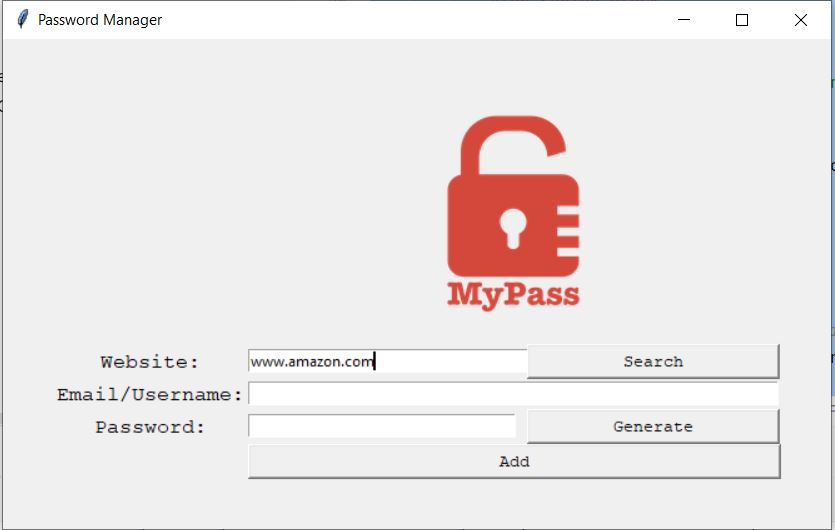

# Password Manager

This is a simple password manager application built using Python and Tkinter. It allows you to store login details for different websites securely. You can add, search, and generate passwords using this application.

## Features

- Add login details: Enter the website, email/username, and password, and click the "Add" button to save the login details.
- Generate password: Click the "Generate" button to generate a random password and automatically fill it in the password field.
- Search login details: Enter the website and click the "Search" button to retrieve the saved login details for that website.
- Validation and error handling: The application ensures that all required fields are filled before saving the login details. It also provides error messages for missing or incorrect information.

## Prerequisites

- Python 3.x installed on your machine.
- The following Python packages need to be installed: `tkinter` and `json`. You can install them using the following command:

  ```
  pip install tkinter json
  ```

## How to Use

1. Run the `main.py` file using Python.
2. The Password Manager window will open.
3. Fill in the website, email/username, and password fields.
4. Click the "Add" button to save the login details.
5. To generate a random password, click the "Generate" button.
6. To search for saved login details, enter the website and click the "Search" button.

## Screenshots



## License

This project is licensed under the [MIT License](LICENSE).

## Acknowledgments

The Password Manager application was developed as part of the "100 Days of Code - Python" challenge.
